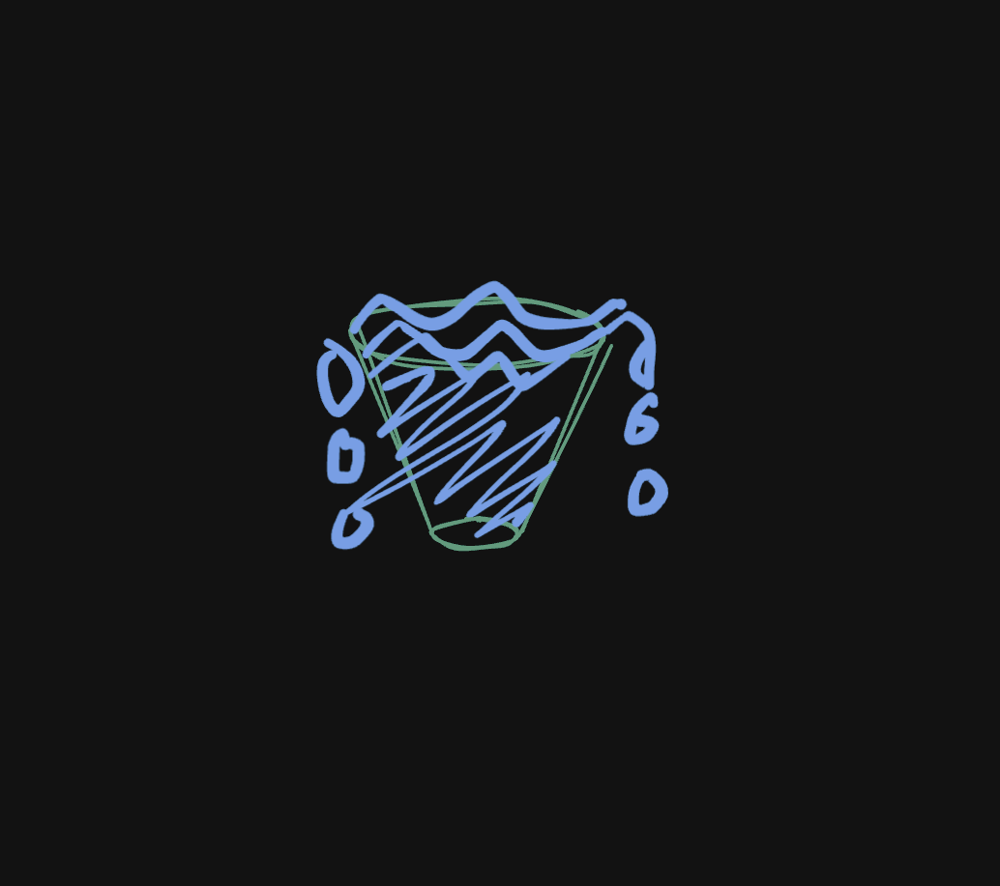
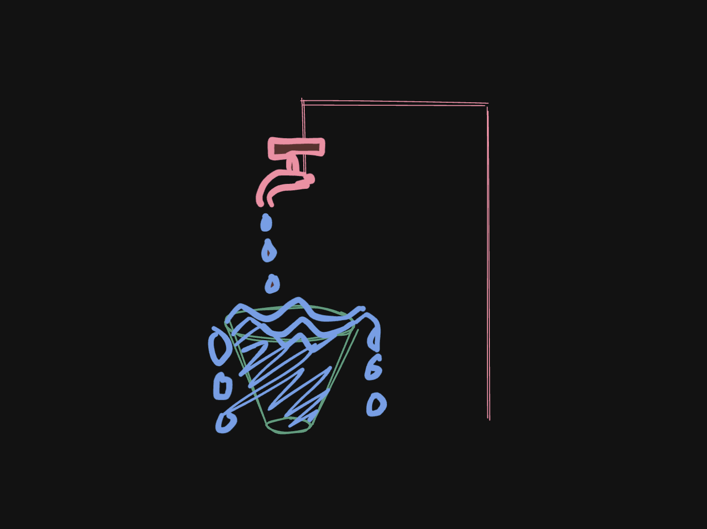
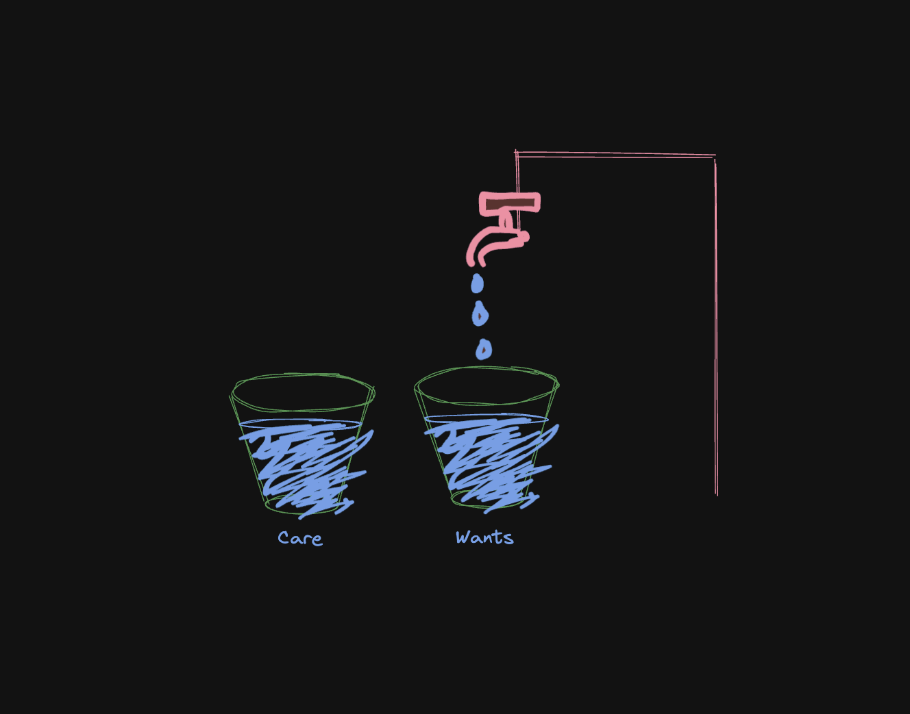

import BlogImage from '@components/BlogImage.astro';
export const components = { img: BlogImage };

> This post is not at all like any of my other posts. This is about life, not coding.

I was waiting in a queue when I had these meditations about buckets and water as life, and hence I'm writing them down here.

Instead of stating the fact outright, and explaining through it later, I'll start by slowing taking you through the process of how I got to this point. There won't be a tldr to this post. There is absolutely nothing groundbreaking here. Just trying to manage expectations.

## The one full bucket

When you are born, you already have a bucket full of water and it's overflowing!! That is the time when life gives you everything you could every need. And what does an infant need? Love, care and nourishment. That's it.

And this is pretty much what we need for the first few years of our life.

And on top of it, there's a top right over the bucket. When you are born, the tap is dripping water drop by drop all day, very little, but that's all you need.

## Two buckets

Then we start to get older. We start understanding toys. This is when we add a second bucket. And as you grow older from infant to toddler, the tap drip-drip turns into a steady weak stream of water, providing much more water.

However, as you can see in the figure above, now the buckets aren't overflowing. They have plenty of water, just not overflowing. And the same water supply that increased, is not enough to fill both up and make both overflow. An average toddler is happy with this. In fact if you'd look back you'd probably remember the memories of this days, spare they maybe, more fondly than perhaps most other stages of ur life. I do 😄

## More buckets

Now you are 12 years old. Suddenly you care about grades, looking cool in school, cars, makeup and what not. Suddenly your wants are more! One bucket, which was only for toys before isn't enough. It splits up into some more. You also get 1-2 extra buckets, and these are based out of fear: Grades, looking cool to peers, etc.

Your water supply also have increased to be a steady flow of water. However, now the buckets are so many, that it takes much more upkeep and maintenance to keep them all filled up well. However, other than the antsy teenage nature, you are still somewhat happy and content with life. Every bucket has enough water in it to have a nice fulfilling day.

## TOO DARN MANY BUCKETS

Now you are 20 years old. You are in college/uni, there's a pressure of higher studies, or of getting a job, paying off student loans, supporting your family, etc. Now you have a lotttttt of buckets, and most of them at this point are out of fear, and have water at just the bottom, and are in danger of running dry. The tap is now giving out even more water than it ever did, but now it's not increasing!! The water coming out of it won't increase much more now. And you have dozens of buckets to keep up with. If one of them dries up fully, it leads to hurt and pain in life.

So at this point, you are in a state of constant fear of running out of water, and are in a firefighting mode. You are listening to everyone for suggestions, having a burst of hope and moving from bucket to bucket hoping just a bit more water will make it full and you can do that for all the buckets.

While the reality is that all of them will be just somewhat full at the bottom, and none will fill up. This is what leads to an unsatisfied life. This is also the paradox of choice, where having too many choices makes life less satisfying than having fewer choices.

## The rules

After all this, I still haven't conveyed the rules of this game of buckets and water.

### Rule 1: One bucket at a time

After one age, when your buckets being barely filled up becomes the norm, is when life unlocks an offer for you: If you can manage to fill up just one bucket, life will give you that need/desire directly! It's like genie coming out of the lamp when the bucket overflows, and giving you a wish, related to the bucket you just filled up.

### Rule 2: More water!!

As you start filling up these buckets fully, you will notice that suddenly, the water supply just increases. For every bucket you fill up, the water supply increases by a certain amount. This makes the next bucket easier to fill up, and the next one even easier. And so on.

## The secret

Do you see?? The secret to a happy life when you have too many buckets is to cut down on them. Cut down on the non-essential buckets, and pick one bucket to fill up. Just one, even if it means few other buckets may run dry. This could mean sacrificing family time for building wealth, or prioritizing family life over wealth building. Only one bucket can have the priority. This could mean working on weekends instead of partying.

Pick one bucket to focus on, and direct all water supply towards it. It'll take a long time to fill it up, and other buckets _will_ run dry, which is what you can call **Sacrifice**.

However, once the one bucket is full and overflowing, life grants you a wish. If you'd been working your rear off on a new startup, now is when you start to see customers and growth.

And something magical happens when this first bucket fills up: The tap starts giving out more water. At this stage, you get 2 choices: Maker the bucket bigger, or start to use the extra water to fill up the other (maybe dry) buckets.

Choosing to make the bucket bigger means you get better and better returns on the same bucket. You have more water now, and a little bit more of the bucket, which if you fill up, increases the water even more, and if you keep doing it for a long time, eventually you have a giant pond under Niagra falls!! Huge bucket, but INFINITE WATER!!!! This is what makes people successful, super rich, this relentless pursuit of making one bucket bigger. And at that point, you can now kick back, and start filling up the other buckets, which are now dry. But beware, the buckets have been dry for so long they have just faded away like Thanos's snap, and you may never get them back(Health, relationships). Which leads us to the second choice.

When the bucket overflows first time, you take the extra water and use to fill the other buckets. This means ur one full bucket will stay full or near-full, and the other buckets wont dry out either. This is called a balanced life. Its a life where you maintain that one full bucket, and remaining are filled up with as much water you can get. They may never ever get full, but that's ok for you, life is good.

And at this point, in either choice, you can choose to focus on one more bucket, so now you put all extra water into just one bucket and leave other buckets to dry out. This bucket will fill up slower than the first one, as you're not putting all water in it. You can choose to split the water supply in half, which should mean that your original full bucket will become half, but it may mean the 2nd bucket becomes full! And now life grants you another wish, and increases your water supply! Now you can make sure to keep these 2 buckets full at all times, and keep the rest of the buckets somewhat wet. This is also a balanced life, but it came with more sacrifices. It's also more fulfilling.

Now you can choose to focus on 3 buckets in total. This will require even more sacrifices! And most people may not even need this 3rd one, as they may be able to get by with just 2 buckets. Most people aren't even capable of achieving more than 2 buckets full at all times, 3 is hard and 4 is rare!! Most richest people in the world are able to have 2-3 buckets full at all times, however, they also don't have too many buckets. Success comes with decluttering, and decluttering is the key to a happy, calm life.

## Beginners in programming

You can have buckets within buckets too, and we call it a niche. Once example is beginners in programming. They tend to focus on learning multiple domains all at once, trying to keep multiple sub-buckets full, while the key to success is to keep just the one bucket full, and a few extra buckets lying in reserver.

After first 100 hours of exploring all different platforms and domains, beginners should be able to narrow it down to 3 domains maximum. And after 500 hours, they should be able to narrow it down to 2 domains maximum. After 1000 hours, they should be able to narrow it down to 1 domain maximum. This is when you start the journey to becoming expert in a domain, and that's when the true compounding begins

## Conclusion

This is a very simple and naive way of thinking about life. It's not the only way, and it's not the only way to be happy. But it's a good way to start. And it's a good way to keep you sane. And it's a good way to keep you focused and happy!

Thank you for reading, and I hope you enjoyed this post.

Peace ✌️
